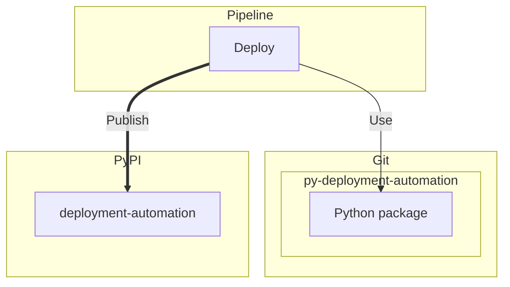

# py-deployment-automation

Automated the deployment to PS, Docker repository, git repositoties.

## Pipeline

```mermaid
graph TB
	subgraph git[Git]
		subgraph git_deploy[py-deployment-automation]
			git_deploy_package[Python package]
		end
	end

	subgraph pipeline[Pipeline]
		pipeline_deploy[Deploy]
	end

	subgraph pypi[PyPI]
		pypi_package[deployment-automation]
	end

	%% Pipeline
	pipeline_deploy -- Use --> git_deploy_package
	pipeline_deploy == Publish ==> pypi_package
```
